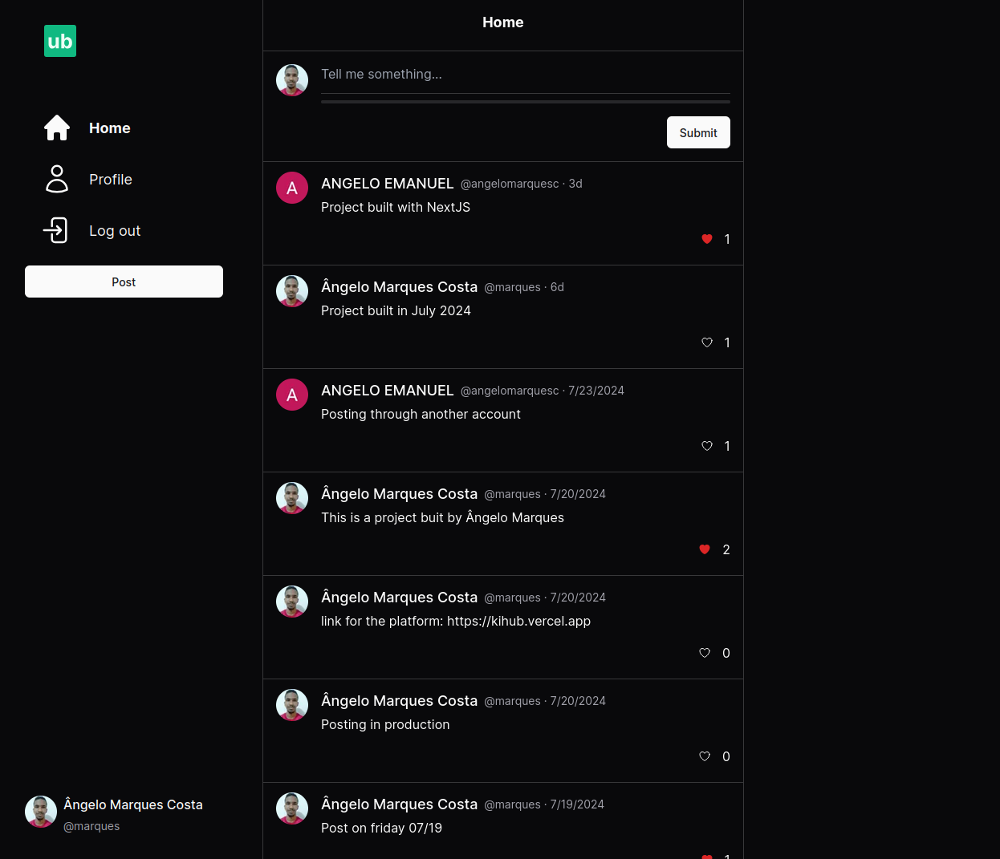
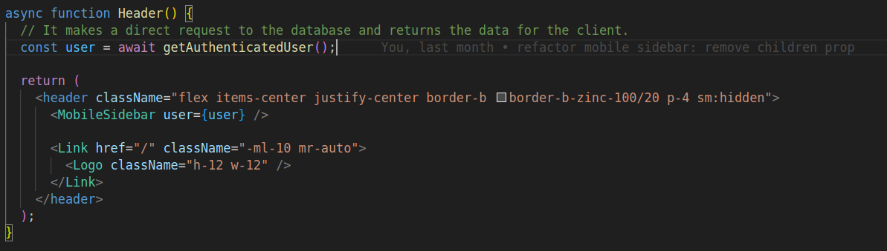
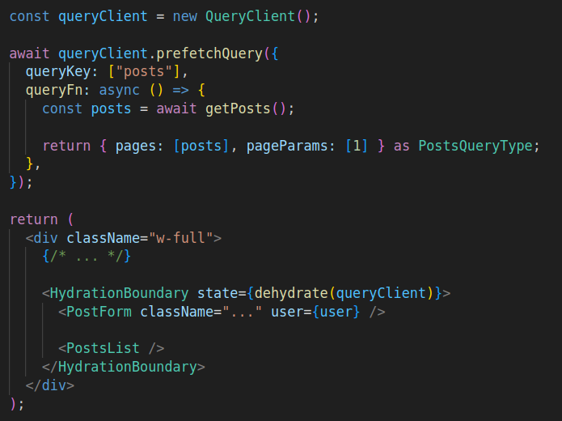
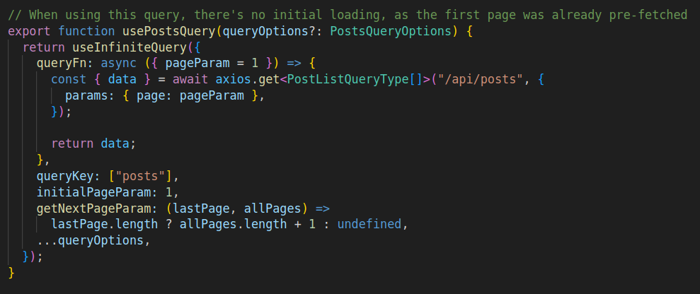
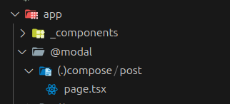
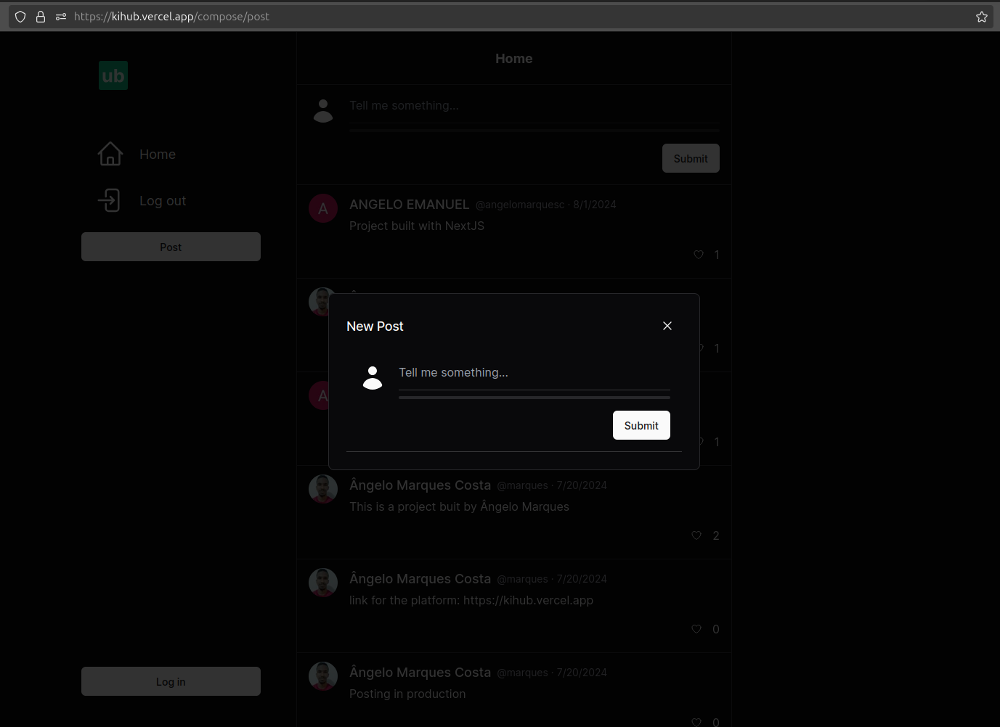
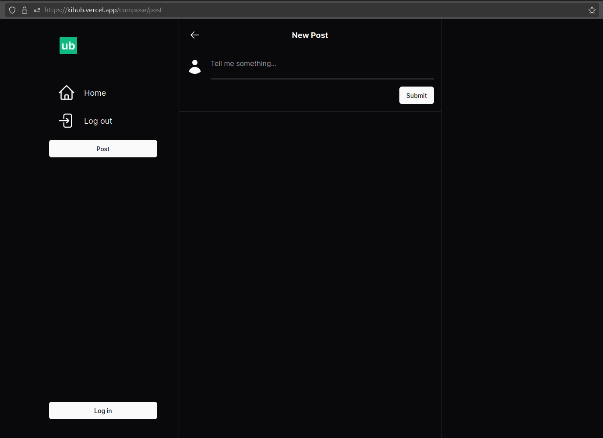

# Kihub
[Kihub](https://kihub.vercel.app/) is a Twitter clone project that allows users to authenticate, update their profiles, post messages, and like posts. This project leverages modern web development tools and practices to create a fast and user-friendly experience.

[kihub.vercel.app](https://kihub.vercel.app/)

## Table of Contents
- [Technologies Used](#technologies-used) 
- [Architecture](#architecture)
    - [React Server Components](#react-server-components)
    - [SSR With React Query](#ssr-with-react-query)
    - [Intercepting Routes](#intercepting-routes)
- [Contributing](#contributing)
- [License](#license)

## Technologies Used

- React Query: For efficient data fetching and state management.
- React Server Components: For SSR implementaition, better performance, and scalability. 
- TailwindCSS: For styling.
- Shadcn UI: For user interface components.
- Drizzle ORM: For interacting with PostgreSQL database.
- Kinde: For authentication.
- Zod: For schema validation.
- Next.js: For server-side rendering and building the frontend.

## Architecture
### React Server Components
Server Components are a new type of Component that renders ahead of time, before bundling, in an environment separate from your client app or SSR server.

### SSR With React Query
React Query enables seamless integration of Server Side Rendering (SSR) with Next.js by allowing queries to be prefetched in React Server Components. As a result, when the query is accessed on the client side, the data is already available, enhancing performance and user experience.

     
    

### Intercepting Routes
Intercepting routes allows you to load a route from another part of your application within the current layout. This routing paradigm can be useful when you want to display the content of a route without the user switching to a different context.

It was implemented with the Parallel Routes feature of Next.js, which allows you to simultaneously or conditionally render one or more pages within the same layout. 

    

When you click the "Post" button in the sidebar, it redirects to "/compose/post", but it only displays a modal, overlaying the feed.

If you reload the page, it will show the actual page for the "compose/post" route.

## Contributing
Feel free to submit issues or pull requests if you have suggestions or improvements.

## License
This project is licensed under the [MIT License](LICENSE).